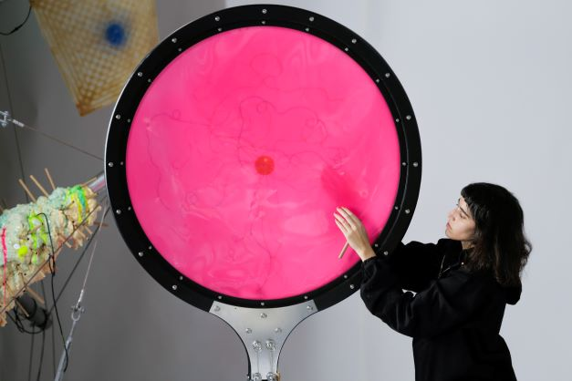
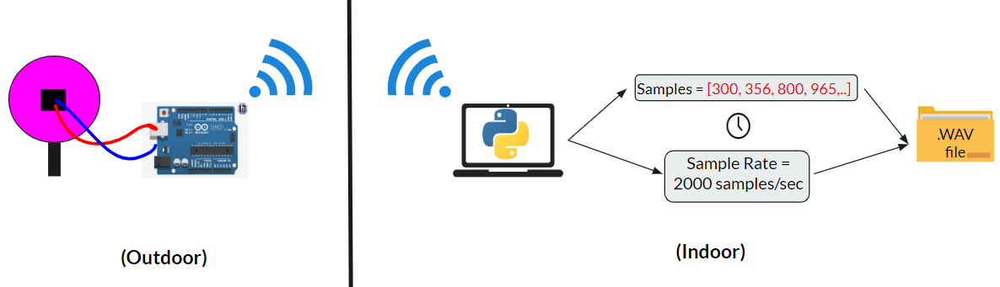
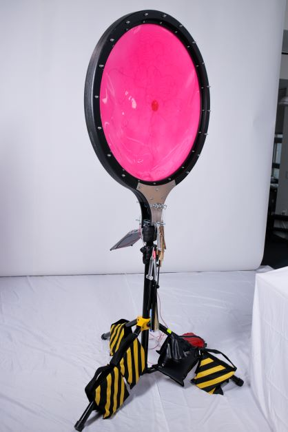

_Membranas_ is a spatial sound sculpture meant to facilitate more than human exchanges.I worked on this project in collaboration with Nicole L'Huillier for her thesis project at the MIT Media Lab. With this work we aimed to explore sounds and vibrations as media for stimulating collectivity, embodied learning, and interconnectivity well beyond the human.

When I started working with Nicole on this project, we talked about using an element of the sculpture to record the wind and present it in a sonically enhanced yet authentic way. Wind sort of takes on the sound of whatever its interacting with, and it seemed like the perfect medium to help us facilitate a conversation between people and the environment. It was important to us that this communication occured in the **_wind's language_**, that is, in a way that felt true to the wind's voice.

Nicole made an initial attempt at this using contact microphones in a silicone membrane. We listened to the audio recorded using these microphones together and determined that it was picking up wind in the way lots of other microphones do: as a sort of "white noise" that doesn't have much character or liveliness in it. Additionally, the contact microphones recorded a lot of things that weren't the wind, like birds chirping or lawn mowers. We thought we could do better.

I ran a spectrogram analysis and used that to filter the audio from the contact microphones in a variety of ways. I noticed that a lot of the sound we were getting from the wind was both low in frequency and amplitude. After doing some research, I found some interesting papers about accelerometers being used to record low frequency and low amplitude sound, such as that of ants marching under the ground. This matched the character of the sound we were hoping to record, so we moved forward with the accelerometer as our microphone.

In order to turn the accelerometer data into digital audio, I created the following data processing pipeline:

1. I wrote C++ code to collect about 30 seconds worth of samples from the Accelerometer using an Arduino and the I2C communication protocol.

2. In the same C++ code, I wrote a TCP communication protocol to send the samples over WiFi to a computer for post processing.

3. Finally. I wrote a Python script to estimate the sampling rate of the accelerometer, scale the received values so that they would be audible, and write the processed data to a WAV file to be sent to different speakers in the sculpture.

I learned so so much from working on this project, but the biggest takeaways were:

- How to make communication protocols robust by adding checks for missing data and waiting for missing accelerometer measures (that either got lost in I2C communication with the accelerometer or in TCP communication over WiFi with the computer).

- How to interface with hardware components and microcontrollers, as we tried lots of different accelerometers and boards throughout our experiments.

- Learning about filtering methods and signal processing techniques, especially as they relate to digital audio.

Here are some pictures/videos from the finished sound sculpture! I want to thank Nicole so much for her support on the project, and also give a shoutout to Jessie Mindel for the work she did on the sound design and routing for the system!



You can check out more of Nicole's work [here](https://nicolelhuillier.com/)!
