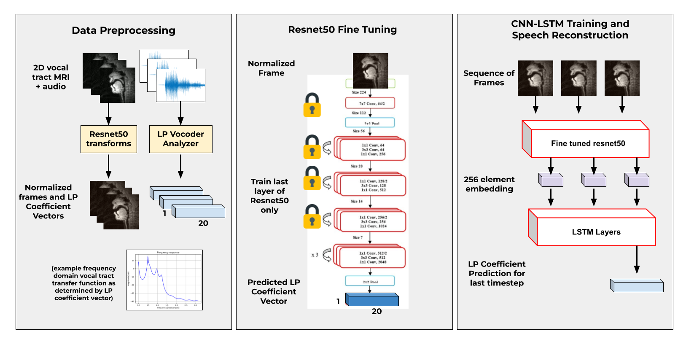
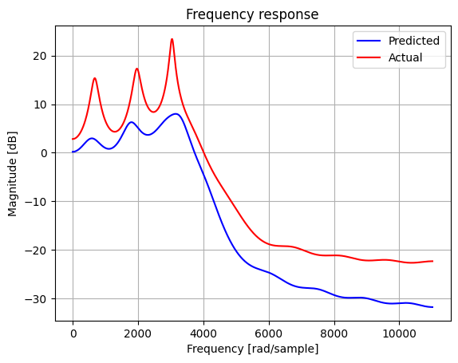
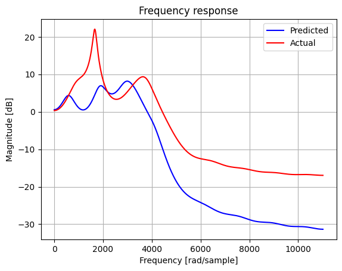
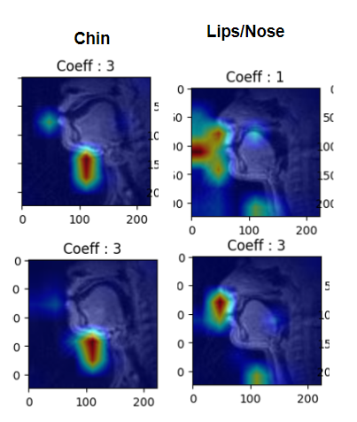
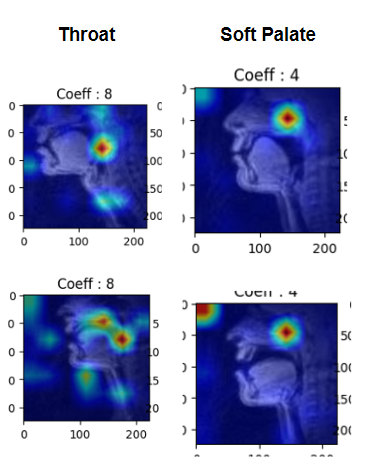

Speech production relies on the coordinated action of the vocal cords and the movement of the vocal tract to generate a variety of sounds. The vocal tract transfer function can be used to characterize the acoustic properties of unvoiced and voiced sounds, but most techniques for estimating this function rely solely on audio signals.

For my final project in "Advances in Computer Vision", I investigated the feasibility of using computer vision techniques to accurately predict the vocal tract transer function coefficients from vocal tract MRI images. I constructed a dataset by employing linear predictive coding
to map 2D Sagittal-view MRI frames to vocal tract transfer function coefficients. Subsequently, I developed and evaluate a CNN-RNN architecture trained on these MRI frame and coefficient vector pairs. While my architecture tends to predict the mean coefficients of the datasets, I demonstrate the potential for added generalization capabilities provided by a combined CNN-RNN architecture, as well as the ability to learn meaningful representations for understanding speech production mechanisms through gradCAM activation visualizations.

<figure>
  
  <figcaption>Overview of methods used to predict vocal tract transfer function from 2D vocal tract MRI video.Video frames and audio are
 separated, and Linear prediction (LP) coefficients are obtained on the audio signal associated with each frame. A Resnet50 CNN is then
 fine tuned for a linear regression task on the LP coefficients using the normalized MRI video frames as inputs. This tuned CNN is then
 used to train a CNN-LSTM model for higher accuracy prediction of the LP coefficients, which can then be used to resynthesize the original
 audio signal associated with a set of MRI image frames</figcaption>
</figure>

I implemented a CNN-RNN architecture for a regression
task on estimated vocal tract transfer function, leveraging
MRI images as inputs. The MRI images and vocal tract transfer functions were obtained through the processing of
a multi-speaker dataset of real-time speech production MRI
video. Initially, I fine-tuned a ResNet50 architecture
to predict the vocal tract transfer function coefficients cor
responding to each frame, thereby learning a 256-element
embedding of MRI image features. Subsequently, a recur
rent neural network with LSTM layers was employed. Its
primary objective was to ingest a sequence of MRI frames
and capture temporal patterns in the features derived from
our pretrained CNN, enabling the prediction of LP coeffi
cients for the last time step in the sequence.

## Results and Evaluation

While initial visual inspection of predicted frequency responses looked promising, upon closer inspection it became clear that the model was learning and predicting the mean of the dataset.

<figure>
  
  
  <figcaption>Frequency responses for predicted and ground truth LP
 coefficient vectors. The plot on the left shows an occasion where
 our prediction happens to match the label quite well, while the
 right plot hints at model prediction of the mean</figcaption>
</figure>

The means and variances of the predicted coefficients as compared to the actual coefficients further confirmed this suspicion.

<!-- <figure>
  
  
  <figcaption>Means and Varaince for each of the 19 LP coefficients across outputs for the test set</figcaption>
</figure> -->

When plotting gradCAM activations for the 19 different coefficients, the model seemed to be using anatomically significant regions of images for prediction, for example the throat, soft palate, chin, and lips/nose. This indicates that future work could develop interpretable models which provide valuable insight into the anatomical features crucial for speech production.

<figure>
  
  
  <figcaption>GradCam activations highlighting the lips, nose, chin, throat, and softpalate for coefficients 1, 3, 4, and 8</figcaption>
</figure>
