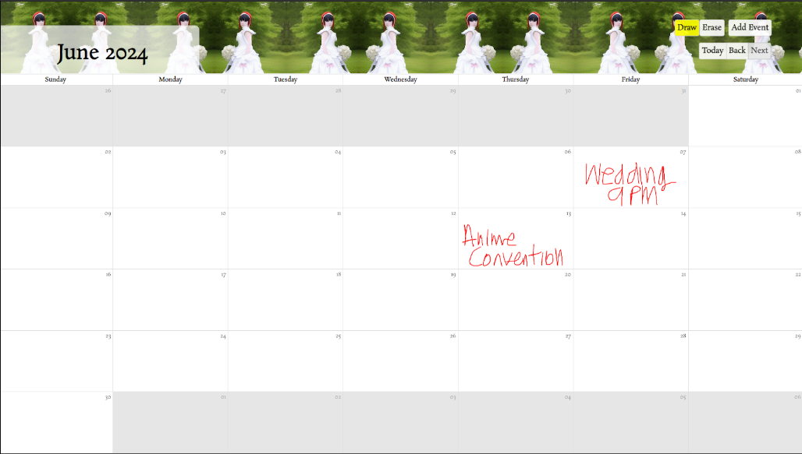
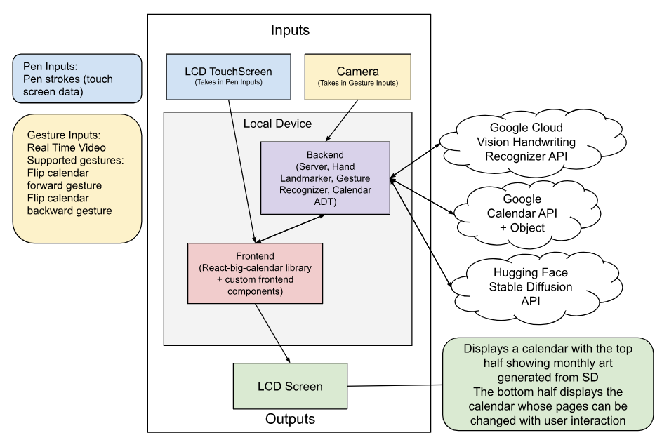

# CalPal: An Intelligent Multimodal Digital Wall Calendar

<figure>
  
  <figcaption>CalPal View for the Month of June, featuring Stable Diffusion generated theming</figcaption>
</figure>

Mobile calendaring platforms such as Google Calendar provide unparalleled convenience and accessibility, yet often lack the tactile engagement and personalized touch of physical wall calendars. For our final project in "Intelligent Multimodal User Interfaces", my partner Jenny Moralejo and I worked together to create "CalPal", an innovative multimodal digital wall calendar designed to bridge this gap by blending digital convenience with the benefits of traditional calendars. CalPal integrates pen-based event tracking, seamless synchronization with Google Calendar, intuitive gesture-based navigation, and dynamic theming based on monthly events.

## System Demo

<iframe width="560" height="315" src="https://www.youtube.com/embed/TuvQ1oiRmB8?si=SrWRqU1gVDOsHQOi" title="YouTube video player" frameborder="0" allow="accelerometer; autoplay; clipboard-write; encrypted-media; gyroscope; picture-in-picture; web-share" referrerpolicy="strict-origin-when-cross-origin" allowfullscreen></iframe>

## System Design and Architecture

We decided to prototype CalPal as a fullstack web application using ReactJS to develop the frontend served by a  Python Flask backend. This allowed us to rapidly prototype
a user interface and maintain a stateful application which
could process multimodal inputs as seen in the below architecture diagram. Over
all our system takes in two types of inputs: pen based and
gesture based to manipulate the calendar. The pen based input is passed to the front-end, while the gesture based input is passed to the backend. These two components
work together to pass information while querying outside
libraries such as the Google Cloud Vision API for hand
writing recognition, Google Calendar API for event syncing, and Hugging Face API for stable diffusion generative
calendar theming, to render and change the display based
on user input.

<figure>
  
  <figcaption>Overall Architecture for the CalPal System</figcaption>
</figure>

## Project Report

If you're interested in learning more, lots of the details are available in our project report writeup below!

<object data="./../calpal/CalPal_Project.pdf" type="application/pdf" width="75%" height="500px">

Unable to display PDF file. <a href="./../calpal/CalPal_Project.pdf">Download</a> instead.

</object>
