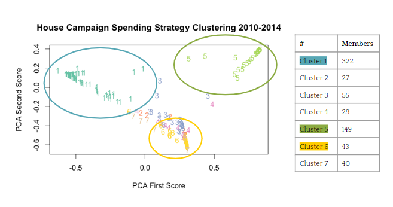
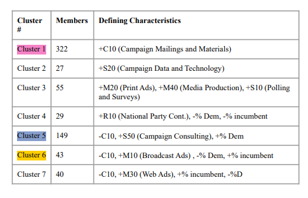
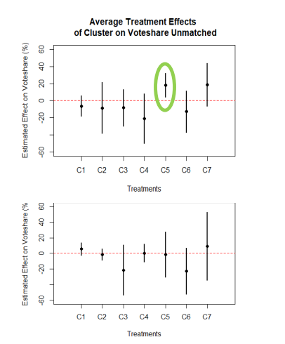

# Campaign Spending Strategies and Election Outcomes

For my group's final project in a Machine Learning and Data Science in Politics class at MIT, we used k means clustering and some causal analysis methods to categorize campagin spending data into distinct strategies, and investigate how spending in these strategies can influence election outcomes. 

## Project Motivation

The motivation for this project stems from the fact that campaigns spend millions of dollars every year trying to win elections, and politicians inevitably end up spending a lot of time trying to raise funds for this expenditure. 

This begs the question: What's the best way to spend that money? In the US, candidates for the Senate and House who outspend their opponents
win approximately 80-90% of the time. Could certain allocation decisions and spending strategies help lower-funded candidates maximize their chances of winning the election?

## Data Analysis Strategy

To answer this question, we first identified and characterized spending strategies through a principal component analysis, k-means clustering, and a difference of means visualization. In order to better understand the impact of each spending strategy on election outcome, we matched candidates and calculated the Average Treatment Effect (ATE) of each spending strategy. All of our data analysis was done in R.

For the project, we specifically focused on data for candidates for the US House of Representatives in 2010, 2012, and 2014. We selected campaign spending categories and demographic information commonly used for voting behavior analysis. A list of the datasets used can be seen in the poster presentation of this project at the end of the page. 

After running a principal component analysis and using the top principal components in our k-means clustering algorithm, we identified 7 distinct spending clusters. 

<figure>
  
  <figcaption>Candidate campaigns grouped by K Means Clustering</figcaption>
</figure>

To see what variables from our data set characterized these clusters, we ran a difference in means analysis of the spending, candidate, and district variables between each cluster and the overall data. Here is a chart displaying some of the defining characteristics for each of the identified spending clusters. Of particular interest to us were clusters 1, 5, and 6, as they seemed most distinct from the other clusters on the basis of these first two principal components. 

<figure>
  
  <figcaption>Charateristics of the 7 identified clusters</figcaption>
</figure>

The clusters of our data were mostly explained by 1-2 spending categories, party of the candidate, and incumbency. For example, we'd expect the candidates belonging to cluster 1 to have spent relatively more on campagin mailings and materials. For candidates in cluster 5, we'd expect more spending in campagin consulting, and more democrats spending in this area than in other spending clusters.

## Causal Analysis

To determine if spending according to a strategy defined by any of the clusters that we identified would have a notable impact on the outcome of an election, we first matched candidate campaigns by a variety of variables like candidate gender, candidate age, district size, etc. We then analyzed the Average Treatment Effect (ATE) of each of the 7 identified clusters on our voteshare data. 

To calculate the ATE, we  used an OLS regression of vote share on the treatment variables for each cluster. Shown below are the 95% confidence interval for the Beta term of the linear regression for both unmatched and matched candidates by cluster. 

<figure>
  
  <figcaption>Average Treatment Effects for the 7 spending clusters we identified</figcaption>
</figure>

The confidence intervals for ATE are large, and most of them touch 0. Thus, our data does not necessarily show a causal relationship between cluster classification and vote-share. However, cluster 5 does have a rather high ATE with a confidence interval not including 0. The Beta for this cluster’s regression was at 18.03. This suggests that allocating spending towards campaign consulting, which characterizes cluster 5, could possibly help a candidate win a higher percentage of votes in their election.

## Thoughts and Project Poster

This was a really cool project, I liked being able to work with real world data to answer a laregly-scoped question like the one we were investigating. We designed the analysis for the project, came up with a research question, found and cleaned the appropriate data, coded the analysis and presented our results. It was great having ownership over that whole process from start to finish. 

Here's the poster we presented for our research:

 <object data="./../campaignspending/spending_poster.pdf" type="application/pdf" width="75%" height="500px">
      
Unable to display PDF file. <a href="./../campaignspending/spending_poster.pdf">Download</a> instead.

