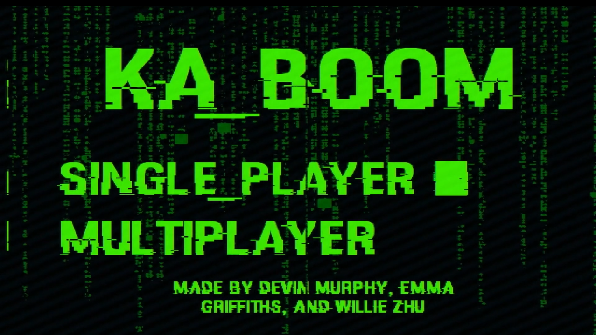
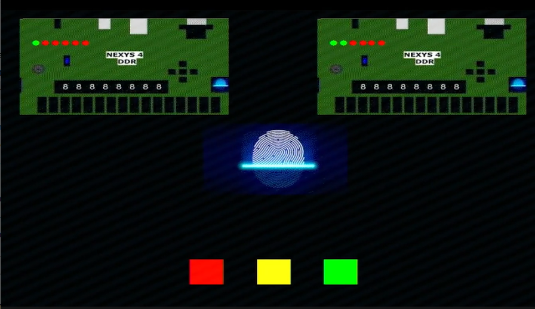
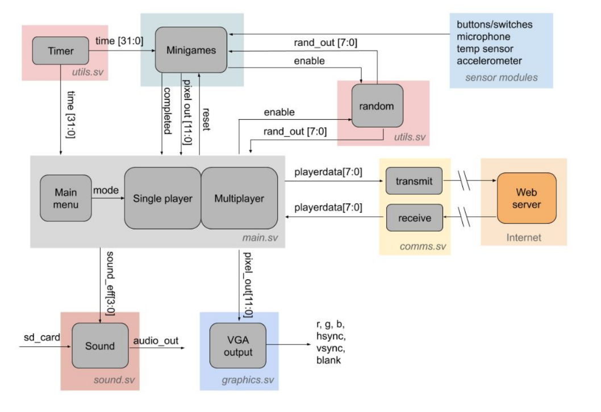

# Kaboom 

Kaboom is an FPGA based multiplayer game based off of the game ["Keep Talking an Nobody Explodes"](https://keeptalkinggame.com/). It was developed in tandem with Emma Griffiths and Willie Zhu as a final project for the class [6.111](https://keeptalkinggame.com/), Introductory Digital Systems Laboratory, which I took during my Junior year at MIT. 

<figure>
  
  <figcaption>Title Screen for the Kaboom Game</figcaption>
</figure>

Inspired by the techy aesthetic of the FPGA, the objective of this game is to defuse a bomb before time runs out.
There are various modules that must be disarmed, the order of which appear in a
predetermined, random order and one after another on the screen. All minigame
modules also have elements of randomness. When a Defuser gets a strike, they will have to
replay the module they are currently on.

<figure>
  
  <figcaption>Fingerprint scan minigame that used the onboard temperature sensor</figcaption>
</figure>

We decided to add two modes to
our game, both single player and multiplayer. In single player you race against the clock using
the manual to defuse the bomb, and in multiplayer you race against another player to defuse
the bomb faster using an esp32 module and websocket to connect the boards. The other
player’s status will be displayed on your screen in multiplayer mode. If they are all disarmed before time runs out, then the bomb is defused.
There is also a strike system. If you get three strikes (fail modules three times), then you will
lose. The game is accompanied by a bomb defusal manual, which is purposely written in a
non-straight forward manner to make defusing the bomb a bit more difficult.

<object data="./../kaboom/kaboom_manual.pdf" type="application/pdf" width="75%" height="500px">

Unable to display PDF file. <a href="./../kaboom/kaboom_manual.pdf">Download</a> instead.

</object>

The minigames engaged with several sensors on the FPGA, including a microphone, temperature sensor, and accelerometer. Additionally, our system engaged with a speaker and VGA output (for the graphics). Here is a block diagram of all the components of the system:

<figure>
  
  <figcaption>Block diagram of the different modules making up the Kaboom game architecture</figcaption>
</figure>

I handled the design and implementation of much of the overarching game logic using Finite State Machines, as well as graphics for several of the minigames. Overall, this project gave me a deeper understanding of what hardware is doing when rendering graphics, which was pretty neat! Here's the video we put together for the project:

<iframe src="https://player.vimeo.com/video/876750178?badge=0&amp;autopause=0&amp;quality_selector=1&amp;progress_bar=1&amp;player_id=0&amp;app_id=58479" frameborder="0" allow="autoplay; fullscreen; picture-in-picture" style="position:absolute;top:0;left:0;width:100%;height:100%;" title="kaboom_final_video"></iframe>

You can find out more about the implementation details for the game in the report below:

<object data="./../kaboom/kaboom_final_report.pdf" type="application/pdf" width="75%" height="500px">

Unable to display PDF file. <a href="./../kaboom/kaboom_final_report.pdf">Download</a> instead.

</object>

