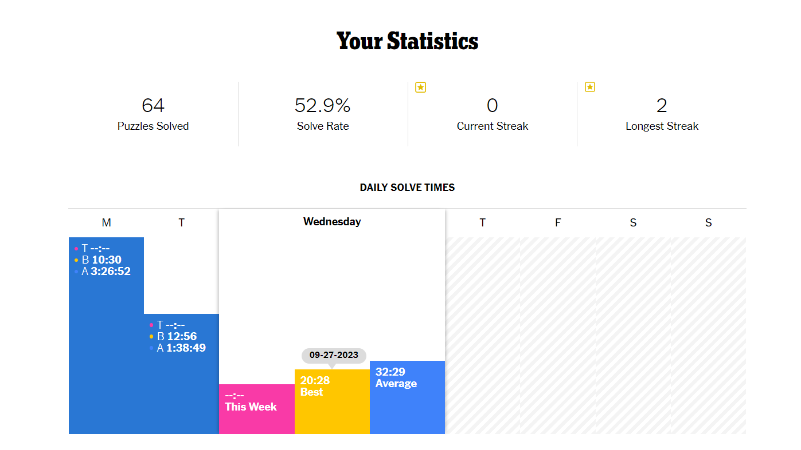

# New York Times Crossword Statistics Collector

I've been wanting to experiment with chrome extensions for a while now, and this was my first foray into that world. I recently got into the habit of doing the New York Times crossword on a semi regular basis. I discovered the statistics page on the New York Times games website, and was kind of disappointed with the lack of range of statistics offered (they only really include time to solve the puzzles)

I was curious about lots of other things, like; How close am I to my all time solve record right now? What are words that I see a lot in puzzles? What are words that I tend to miss in puzzles (give up on/reveal)? I figured making a chrome extension to track these sorts of things this would be a good way to learn about chrome extensions and also get some insights into the knowledge/improvement I'm gaining from crosswording!

To use the extension, you can navigate to the page of any crossword you're working on or have solved. There are two sections, "Current Puzzle Stats" and "All Time Stats". Under the current puzzle stats, you can see things like

- How many clues are currently filled
- How many clues are in this puzzle
- What percentage of clues have you filled
- The split between your current time and record solve time

Once you've completed a puzzle, you can collect statistics for it using the "Collect Stats" button. Upon collecting, the "All Time Stats" section will display

- The fastest solve
- The number of puzzles solved
- The words encountered the most in puzzle solving
- Words frequently missed in puzzle solving

Here's a clip of the extension in action: 

<iframe src="https://player.vimeo.com/video/870505576?badge=0&amp;autopause=0&amp;player_id=0&amp;app_id=58479" frameborder="0" allow="autoplay; fullscreen; picture-in-picture" style="position:absolute;top:0;left:0;width:100%;height:100%;" title="nytvid_trim"></iframe>

And a [link](https://github.com/devinmur29/nyt-xwd-extension) to the code for the extension

